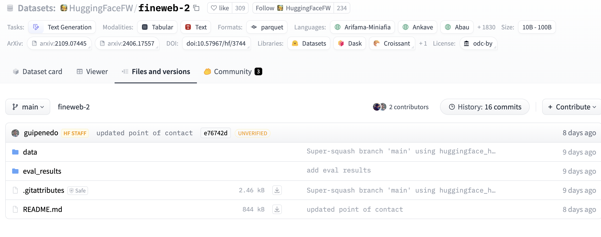
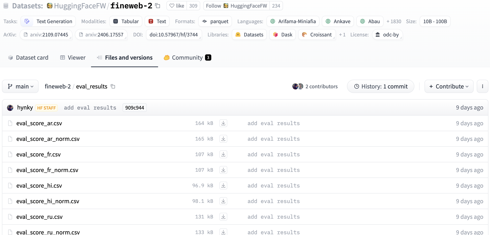
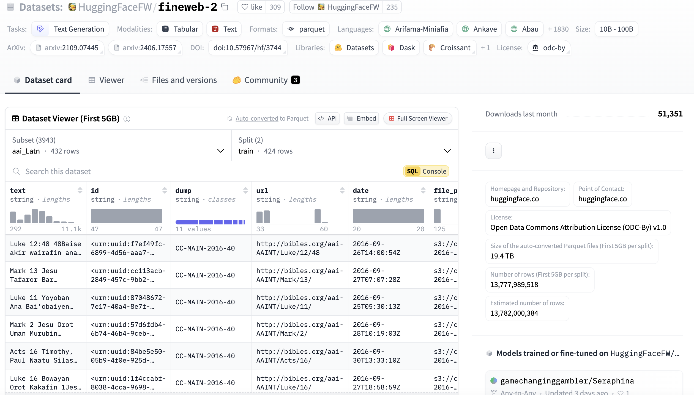

# HuggingFace Hub tooling

The Hugging Face Hub is home to a growing collection of [datasets](https://huggingface.co/docs/hub/datasets) that 
span a variety of domains and tasks.

## HuggingFace datasets

Each dataset in Hugging face is a Git repository that contains the data required to generate splits for 
training, evaluation, and testing. You can look at these repositories directly through the web:

```
https://huggingface.co/datasets/<username>/<dataset-name>
```

In addition to this you ca use:

* [Hub web UI](https://huggingface.co/docs/hub/datasets-adding#upload-using-the-hub-ui) to create
a repository, examine it, upload and download files, and create a dataset card
* [Huggingface_hub client library](https://huggingface.co/docs/hub/datasets-adding#using-the-huggingfacehub-client-library). 
More on the library is [here](data_access).
* [Other libraries](https://huggingface.co/docs/hub/datasets-adding#using-other-libraries). The lis
of libraries supporting Hugging face Hub can be found [here](https://huggingface.co/docs/hub/datasets-libraries)
* [Git](https://huggingface.co/docs/hub/datasets-adding#using-git). As datasets are GIT repositories
(with the specific locations managed by Hugging face) direct git commands can be used for their management. For 
example the following command:

```commandline
git clone git@hf.co:datasets/blublinsky/test
```
can be used for cloning a `test` repo for the user `blublinsky`

Overall structure of the dataset repository is shown below:



The main part of repository is data, containing, the actual dataset data (as parquet files) 


THe evaluation contains different types of data evaluation (in csv format)



Each dataset may be documented by the README.md file in the repository. This file is 
called a dataset card, and the Hugging Face Hub will render its contents on the dataset’s main page. 



To control how the Hub displays the card, you should create a 
[YAML section](https://huggingface.co/docs/hub/datasets-cards#dataset-card-metadata)
in the README file to define some metadata. 

The metadata that you add to the dataset card enables certain interactions on the Hub. For example:

* Allow users to filter and discover datasets at https://huggingface.co/datasets.
* If you choose a license using the keywords listed in the right column of this table, the license will be displayed on 
the dataset page.

When creating a README.md file in a dataset repository on the Hub, you can use Metadata UI to fill the main metadata 
components. You can also refer to [documentation](https://github.com/huggingface/datasets/blob/main/templates/README_guide.md)
or use the hugging face [application](https://huggingface.co/spaces/huggingface/datasets-tagging). The complete spec is
available [here](https://github.com/huggingface/hub-docs/blob/main/datasetcard.md?plain=1)

##  Grouping accounts and datasets management

The HuggingFace Hub offers [Organizations](https://huggingface.co/docs/hub/organizations), which can be used to group 
accounts and manage datasets, models, and Spaces. The Hub also allows admins to set user roles to control access to 
repositories 

Similar to a dataset card, you can create an organization card to help users learn more about what your organization 
is working on and how users can use your libraries, models, datasets, and Spaces.

Additional support for organizations is provided by the enterprise version of huggingface hub.

## Hub API Endpoints

HuggingFace Hub provides a set of API [endpoints](https://huggingface.co/docs/hub/api) that can be used to retrieve 
information from the Hub as well as perform certain actions such as creating model, dataset or Space repos. For 
the majority of these APIs HF provides a wrapper Python library, huggingface_hub, that allows easy access to these 
endpoints. HF hub also provide webhooks to receive real-time incremental info about repos.
