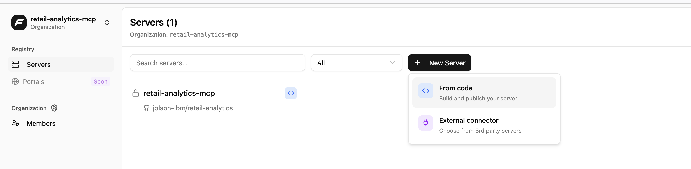
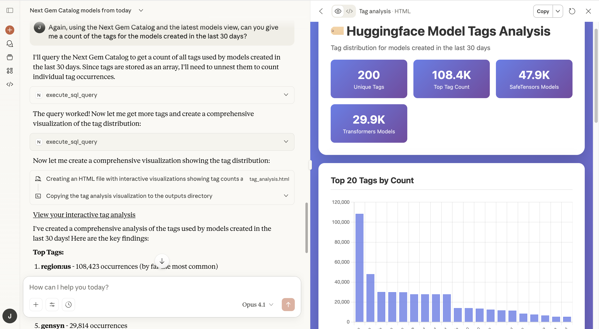

# Next Gem Data Catalog MCP server

This is an initial implementation of a simple MCP server using the FastMCP framework for the Next Gem Data Catalog. The intent is to demonstrate how to build a MCP server and use it for decision support when accessing models stored in Huggingface. 

## Deployment

The quickest deployment path is to use [FastMCP Cloud](https://fastmcp.cloud/) to deploy this repository as a remote MCP server:

1. Fork this repository
2. Sign up for a free [FastMCP Cloud](https://fastmcp.cloud/) account.
3. [FastMCP Cloud](https://fastmcp.cloud/) will ask for access to your forked repository. It will deploy as a remote MCP server, and return the MCP endpoint. You will also need to set the following environment variables to connect to an AWS Athena data source:
- AWS_ACCESS_KEY_ID
- AWS_SECRET_ACCESS_KEY
- AWS_REGION
- ANALYTICS_BUCKET
- NEXT_GEM_DATA_CATALOG_DATABASE_NAME

## Usage

Once the server is successfully deployed, it can be used with any of the GenAI providers that allow a remote MCP server to be used as a tool. For example, Claude desktop:

1. On the Claude Desktop UI, select the "Search and Tools" button:
2. On the context menu, scroll down to "Manage Connectors"
3. Select "Add custom connector". On the "Add custom connector" form, add a name for the MCP server, and add the URL to the MCP server provided by FastMCP Cloud. 

## Testing

1. Once connected, you can use the natural language chat interface to help develop and execute analytic reports against the Huggingface models. See below for some sample prompts.

