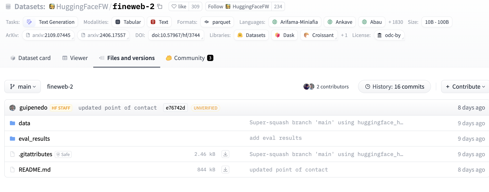
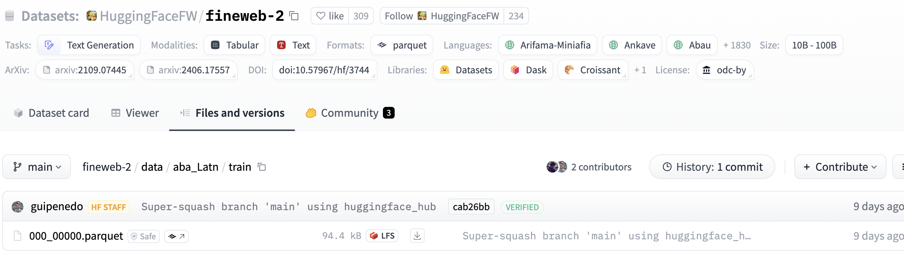
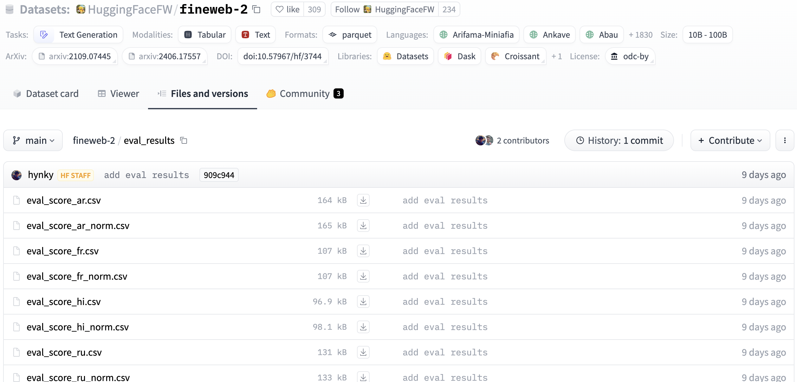
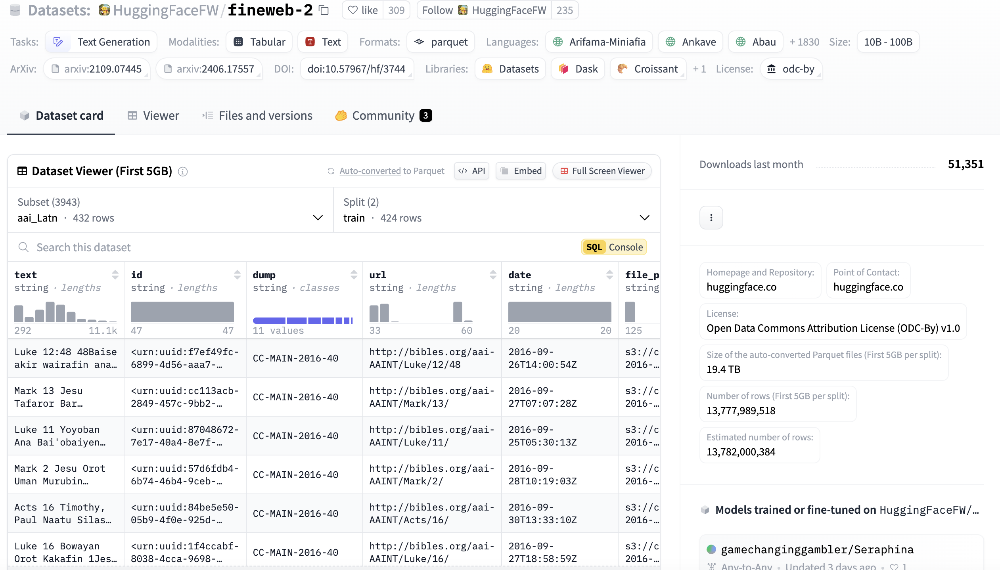

# Hugging Face Hub Tooling

The Hugging Face Hub is home to a growing collection of [datasets](https://huggingface.co/docs/hub/datasets) that span a variety of domains and tasks.

## Hugging Face Datasets

Each dataset in Hugging Face is a Git repository that contains the data required to generate splits for training, evaluation, and testing. You can look at these repositories directly through the corresponding web interface:

```
https://huggingface.co/datasets/<username>/<dataset-name>
```

In addition, you can use the following:

* [Hub web UI](https://huggingface.co/docs/hub/datasets-adding#upload-using-the-hub-ui) to create a repository, examine it, upload and download files, and create a dataset card.
* [The client library](https://huggingface.co/docs/hub/datasets-adding#using-the-huggingfacehub-client-library) for the [`huggingface_hub`](https://github.com/huggingface/huggingface_hub). More on the library is [here](data_access/README.md).
* [Using other libraries](https://huggingface.co/docs/hub/datasets-adding#using-other-libraries). The list of libraries supporting Hugging Face Hub can be found [here](https://huggingface.co/docs/hub/datasets-libraries).
* [Using Git](https://huggingface.co/docs/hub/datasets-adding#using-git). As datasets are GIT repositories, with the specific locations managed by Hugging Face, direct git commands can be used for their management. For example, the following command can be used for cloning a `test` repo for the user `blublinsky`:

```commandline
git clone git@hf.co:datasets/blublinsky/test
```

The overall structure of a dataset repository is shown here:



The main part of repository is the `data` directory, containing, the actual dataset data (as parquet files): 



The `eval_results` directory contains different types of data evaluation (in CSV format):



Each dataset may be documented by the `README.md` file in the repository, which functions as the _dataset card_. The Hugging Face Hub will render its contents on the dataset’s main page, like this:



Note that we [require](https://the-ai-alliance.github.io/open-trusted-data-initiative/dataset-requirements/) a dataset card for our cataloged datasets.

To control how the Hub displays the card, you create a [YAML section](https://huggingface.co/docs/hub/datasets-cards#dataset-card-metadata) in the README file to define some metadata. 

The metadata that you add to the dataset card enables certain interactions on the Hub. For example:

* It allows users to filter and discover datasets at https://huggingface.co/datasets.
* If you choose a license using the keywords listed in the right column of this table, the license will be displayed on 
the dataset page.

When creating a README.md file in a dataset repository on the Hub, you can use the Metadata UI to fill the main metadata components (see this [documentation](https://github.com/huggingface/datasets/blob/main/templates/README_guide.md)). You can also use the hugging face [application](https://huggingface.co/spaces/huggingface/datasets-tagging) for this purpose. The complete spec is available [here](https://github.com/huggingface/hub-docs/blob/main/datasetcard.md?plain=1).

##  Grouping Accounts and Datasets Management

The Hugging Face Hub offers [Organizations](https://huggingface.co/docs/hub/organizations), which can be used to group accounts and manage datasets, models, and Spaces. The Hub also allows admins to set user roles to control access to 
repositories. 

Similar to a dataset card, you can create an organization card to help users learn more about what your organization is working on and how users can use your libraries, models, datasets, and spaces.

Additional support for organizations is provided by the enterprise version of the hub.

## Hub API Endpoints

Hugging Face Hub provides a set of [API endpoints](https://huggingface.co/docs/hub/api) that can be used to retrieve information from the Hub as well as perform certain actions such as creating model, dataset, or space repos. For the majority of these APIs HF provides a wrapper Python library, [`huggingface_hub`](https://github.com/huggingface/huggingface_hub), which allows easy access to these 
endpoints. HF hub also provide webhooks to receive real-time incremental info about repos.
